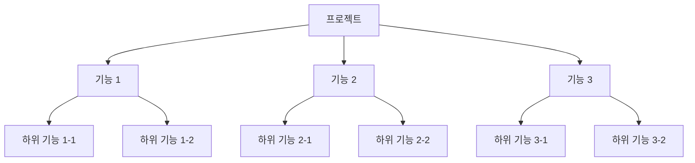

# 캡슐화 프로젝트 방법론

캡슐화 프로젝트 방법론은 복잡한 프로젝트를 작은 기능 단위로 나누어 관리하는 프로젝트 관리 방법론입니다. 이 방법론은 에자일 개발 방법론의 한계를 극복하고, 마이크로서비스 아키텍처(MSA)와 AI 개발 툴의 장점을 활용하여 프로젝트 설계와 관리를 효과적으로 수행할 수 있도록 도와줍니다.

## 주요 특징

1. 기능 분해: 프로젝트의 전체 기능을 작은 단위의 기능으로 분해하여 관리합니다.
2. 계층적 구조: 분해된 기능들은 마인드맵과 같은 계층적 구조로 표현됩니다.
3. 독립적 개발: 각 기능 단위는 독립적으로 개발되고 관리됩니다.
4. 문서화: 캡슐화된 각 기능은 해당 기능에 대한 상세한 문서와 함께 관리됩니다.
5. 점진적 통합: 개발된 각 기능은 점진적으로 통합되어 전체 프로젝트를 완성해 나갑니다.
6. 반복적 개선: 캡슐화 프로젝트는 반복적인 개선과 피드백을 통해 지속적으로 발전해 나갑니다.

## 예시 노드 구조

위 다이어그램은 프로젝트를 기능 단위로 분해하고, 각 기능을 하위 기능으로 세분화한 예시입니다. 각 노드는 독립적으로 개발되고 관리되며, 상위 노드로 점진적으로 통합됩니다.

## 에자일 개발 방법론의 한계 극복

캡슐화 프로젝트 방법론은 에자일 개발 방법론의 한계를 극복합니다. 에자일 방법론은 빠른 개발과 변화에 대한 대응에 중점을 두지만, 프로젝트의 전체적인 구조와 관리에는 어려움이 있을 수 있습니다. 캡슐화 방법론은 프로젝트를 작은 기능 단위로 나누어 관리함으로써 전체적인 구조를 파악하고 관리하기 용이하게 만듭니다.

## MSA와 AI 개발 툴과의 연관성

캡슐화 프로젝트 방법론은 마이크로서비스 아키텍처(MSA)와 잘 어울립니다. MSA는 애플리케이션을 작은 서비스 단위로 분리하여 개발하는 방법론으로, 캡슐화 방법론과 유사한 개념을 공유합니다. 또한, AI 개발 툴을 활용하여 캡슐화된 기능의 개발과 관리를 자동화하고 최적화할 수 있습니다.

## 연관된 프로젝트 관리

캡슐화 프로젝트 방법론은 연관된 프로젝트를 한눈에 보고 관리할 수 있도록 도와줍니다. 프로젝트 간의 의존성과 관계를 명확히 파악하고, 전체적인 진행 상황을 추적할 수 있습니다. 이를 통해 프로젝트 간의 조율과 통합을 원활히 수행할 수 있습니다.

캡슐화 프로젝트 방법론은 복잡한 프로젝트를 체계적으로 관리하고, 개발 효율성을 높이는 데 도움을 줍니다. 이 방법론을 적용하여 프로젝트를 성공적으로 수행할 수 있습니다.
